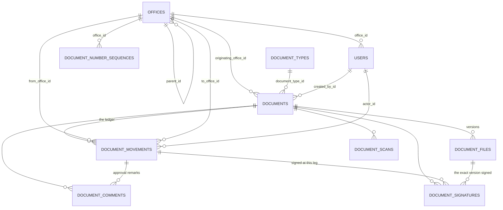

# CICTO — Architecture & Binding Decisions

Read this before writing any code in any phase. Everything here is a decision that
later phases assume. Changing one of these mid-build is a schema migration and a
rewrite, not a refactor.

Companion document: [`../DATABASE.md`](../DATABASE.md) — the PostgreSQL/MySQL
portability rules. This document does not repeat them; it obeys them.

---

## 1. The keystone: one ledger table

`document_movements` is **both the routing record and the audit trail.** One row =
one *leg* = one period of custody.

This single decision funds five separate line items. §5 routing, §10 status
tracking, §13 audit trail, §9 approvals, and per-office dwell time are all reads or
writes of the same table.

**Consequences, all deliberate:**

- No `activity_log` table. No `document_status_history` table. No `approvals`
  table. Approve, reject and return are `action` values on a movement row.
- `spatie/laravel-activitylog` is **rejected** — it would create the second log
  table this design exists to avoid.
- `documents` carries **no `current_office_id`.** The current holder is the single
  open leg, the one row where `departed_at IS NULL`.
- Per-office dwell time is **never stored.** It is `departed_at - arrived_at`.

### Row semantics

Read this table before writing any controller.

| Event | What is written |
| --- | --- |
| Registration (§5) | INSERT `sequence=1`, `from_office_id=null`, `to_office_id=originating`, `action='registered'`, `to_status='initiated'`, `arrived_at=now()`, `departed_at=null` |
| Receive (§9) | Close the open leg, then INSERT a new leg with `from_office_id = to_office_id` (same office), `action='received'`, `arrived_at=now()`. Same-office legs still count — that is how "it sat in HRMO for six days" becomes visible. On a routed document `AdvanceRoute` then forwards it to the next stop, or completes it if that was the last one. (Approve / reject / return wrote the same shape until 2026-09-03; see phase-2-workflow-and-trail.md §2.) |
| Forward A→B (§9) | One transaction: UPDATE open row `SET departed_at = now()`; INSERT `sequence = prev+1`, `from_office_id=A`, `to_office_id=B`, `action='forwarded'`, `arrived_at=now()`, `departed_at=null` |
| Complete | Close the open leg; INSERT terminal leg `action='completed'` with both timestamps set; set `documents.completed_at` |
| Archive (§20) | INSERT `action='archived'`, both timestamps set; set `documents.archived_at` |

**Invariant:** a non-terminal document has exactly **one** row with
`departed_at IS NULL`, and that row's `to_office_id` is the current holder.

This **is** enforceable as a portable database constraint, via a nullable marker
column:

```php
$table->unsignedTinyInteger('is_open')->nullable();   // 1 while open, NULL once departed
$table->unique(['document_id', 'is_open'], 'dm_document_open_unique');
```

Both MySQL and PostgreSQL permit *many* NULLs inside a unique index, so this gives
"at most one open leg per document" **in the database, on both drivers** — without
a PostgreSQL partial index.

`departed_at` remains the semantic truth; `is_open` exists solely to carry the
constraint. They are written in the same statement and a test asserts they never
disagree. Keep the `lockForUpdate()` transaction as well — the constraint prevents
corruption, the lock prevents the error.

Auto-receive is the Phase 1 default. If the client later wants an explicit
"Receive" step, leave `arrived_at` NULL on the new leg and set it on receipt —
**no migration needed.** That is the whole point of shipping the final column shape
in week one.

### The one deliberate exception

`document_scans` is a separate table. A courier scanning a QR label is a *lookup*,
not a *transfer*. Putting scans in the ledger would flood the audit trail with
noise and break the one-open-leg invariant.

---

## 2. Decision register

| # | Decision | Rejected alternative | Why |
| --- | --- | --- | --- |
| D1 | One ledger table for routing + audit | separate `activity_log`, `approvals`, `status_history` | Funds five line items from one table; keeps dwell time derivable |
| D2 | `users.role` string(32) + `App\Enums\Role` | `spatie/laravel-permission` | §2 names exactly three fixed roles. Five extra tables and a permission cache buy nothing at PHP 12,000 — and would not solve office scoping, which is row-level, not verb-level |
| D3 | Office scoping via Policies + one builder method `visibleTo()` | `#[ScopedBy]` global scope | A global scope must silently no-op for console, queue and guest contexts, and it competes with the single shared query scope |
| D4 | Visibility = `EXISTS` against `document_movements` (`to_office_id` OR `from_office_id`) | `documents.office_id` or a denormalised `current_office_id` | Documents move. An office must keep seeing what it already handled |
| D5 | `documents.status` **is** denormalised, with `from_status`/`to_status` on every movement | derive status per query | Deriving would wreck dashboard counts and status filters. A `documents:verify-status` command plus a test proves zero drift |
| D6 | No `enum` columns anywhere | `$table->enum()` | `docs/DATABASE.md` rule. `string` + explicit length + PHP 8.3 backed enum + `Rule::enum()` validation |
| D7 | `document_files` is a child table with `version` from migration one | `documents.file_path` | Makes Phase 3 Version Control a number and a history panel, not a data migration |
| D8 | Control numbers from a locked `document_number_sequences` row | `Document::max('id') + 1` or `count() + 1` | Race-free under concurrency. `SELECT … FOR UPDATE` inside the registration transaction |
| D9 | QR resolves on an unguessable token, never the control number | encode `control_number` in the QR | Control numbers are sequential and guessable. A QR encoding them makes the whole LGU register enumerable by incrementing |
| D10 | Encrypt almost nothing | encrypt document bytes at rest | Laravel has no encrypting filesystem adapter. `Crypt` on file bytes doubles peak memory, breaks streaming and breaks inline PDF preview. **Never encrypt anything searchable** |
| D11 | Zero new packages for RBAC/auth | any permission package | Fortify already provides more than §3 asks for |
| D12 | `string()` everywhere, never `char()` | `char(n)` for tokens/hashes | PostgreSQL blank-pads `char(n)`; Eloquent string comparison then silently mismatches |
| D13 | One-open-leg is a **real** DB constraint via `unique(document_id, is_open)` | test-only enforcement | Both drivers allow many NULLs in a unique index. See §1 |
| D14 | **Never call SQL `now()`/`CURRENT_TIMESTAMP`.** Always bind PHP `now()` as a parameter | mixing PHP and SQL clocks | With `APP_TIMEZONE=Asia/Manila`, PHP time and database-server time are different clocks. Mixing them makes every "time at current office" figure — the headline number of the whole system — silently hours wrong |
| D15 | `APP_TIMEZONE=Asia/Manila`, set **before** any production data exists | UTC storage + conversion on read | Month bucketing then needs no `AT TIME ZONE`/`CONVERT_TZ`. Changing it later retroactively shifts every historical report |
| D16 | Archive is an **explicit `->active()` scope on list views only** — never a global scope | `#[ScopedBy]` / a `notArchived` global scope | A global scope would silently drop archived documents out of monthly volume, status distribution, processing trend, exports and the "total documents" widget — undercounting completed work, the exact opposite of §20's "retrieved later". Consistent with D3 |
| D17 | Overdue is a **query predicate**, never a stored flag column | a `is_overdue` boolean + a cron that sets it | Works with no cron at all, which matters because LGU shared hosting may not have one. Cron is then needed only to *notify* about overdue, not to *know* it |
| D18 | **Calendar days**, not working days | a `holidays` table | Philippine holidays change annually by proclamation. An unseeded table silently falls back to calendar days and reports wrong SLAs — a worse failure than simply not offering the feature. The client's 2026-08-18 office-hours answer informs this without changing it — see the note below |
| D19 | One narrow `security_events` table is permitted — see the amendment below | a general-purpose activity log | |

### Note on D18 — the confirmed office hours make the simplification visible

*(2026-08-18)* The client confirmed the working week: **Monday to Thursday, 7:00 AM
to 6:00 PM.** The "Monday - Thursday" on the supplied design was not a typo for
Friday; the four-day week is real. Only the times were wrong, so
`cicto.deadlines.business_end_hour` moved from 17 to 18 and
`cicto.support.hours_detail` now reads `'7:00 AM - 6:00 PM'`.

**D18 stands.** The answer does not change the decision — it makes the cost of the
decision easier to see. Calendar days do not know the counter is shut: a 3-day
turnaround filed on a Thursday falls due on **Sunday**, three days into a weekend
that starts on Friday, and the badge turns amber for a queue nobody is standing at.
`business_end_hour` cannot rescue that. It clamps the *hour* a deadline lands on; it
cannot express which *days* exist. A working-day engine is still the separate quote
it always was, and this is the sentence to read out before sign-off.

### Amendment to D1 — the one permitted second table

D1 rejects a second log table. That rule is about **document** events: nothing but
`document_movements` records what happened to a document.

It does **not** cover events that have no document — user logins, failed logins,
lockouts, role changes, user CRUD, settings changes, and file *downloads*. Those
need somewhere to go, and forcing them into the ledger would pollute the custody
timeline with reads.

So exactly one narrow table is permitted: **`security_events`** *(Phase 3)*, with a
closed backed-enum vocabulary and a pre-rendered human-readable summary column —
**no JSON column.** Most of its rows come free from one event subscriber
(`Login`, `Logout`, `Failed`, `Lockout`, `PasswordReset`, Fortify 2FA events); role
changes, user CRUD and settings are a handful of explicit `SecurityEvent::log()`
calls.

`file.downloaded` goes here, never into `document_movements`. Reads must not
pollute the custody timeline.

### Status vocabulary — internal vs client-facing

§8 names the filter values the client will look for: **Pending, In Process,
Rejected, Completed**. The internal machine is richer. Neither list is wrong; the
mapping just has to exist, in one place, in the label layer.

| Client-facing (§8) | Internal `DocumentStatus` |
| --- | --- |
| Pending | `initiated`, `returned` |
| In Process | `under_review`, `approved` |
| Rejected | `rejected` |
| Completed | `completed` |

`approved` — a stage nothing has entered since 2026-09-03, but one the client's
older documents are stored in — maps to *In Process*, not *Completed*: an approved
document was still moving. This mapping is a literal §8 acceptance criterion and
it is the kind of thing that gets filed as a bug, so it is pinned by a test.

### Packages

| Package | Phase | Why |
| --- | --- | --- |
| `bacon/bacon-qr-code:^3.0` | 1 | Server-side QR → SVG. Pure PHP, **no gd/imagick requirement** for the SVG backend |
| `@zxing/browser` + `@zxing/library` | 1 (npm) | Browser camera decode. **Install only after HTTPS on the deployment host is confirmed** — if the client chooses a USB keyboard-wedge scanner instead, skip both entirely |
| `barryvdh/laravel-dompdf:^3.1` | 3 | §19 PDF export, and the Phase 3 Signature Certificate. **Cannot parse `oklch()`, flexbox or grid** — PDF views need a hand-written hex stylesheet, they cannot share the Tailwind 4 theme |
| `openspout/openspout:^4.28` | 3 | §19 streaming XLSX. No `php-zip`/`php-gd` requirement |
| `recharts@2.15.4` (npm, via `shadcn add chart`) | 3 | **Pin it.** recharts 3.x breaks shadcn's `chart.tsx`, and an unpinned reinstall silently breaks tooltips |
| ~~`spatie/laravel-backup`~~ | — | **Rejected** — its core value is a shell-out dumper the host may not permit, plus destinations we cannot afford. Replaced by a first-party `backup:run` with a `Dumper` interface (~150 lines) that works whether or not `proc_open` exists. See Phase 3 §5 |
| ~~`spatie/laravel-pdf`~~ | — | Rejected — needs Node **and** headless Chromium **and** `proc_open` on the server |
| ~~`maatwebsite/excel`~~ | — | Rejected — needs `php-zip` and `php-gd`, memory-hungry on shared hosting |
| ~~`spatie/laravel-permission`~~ | — | Rejected — see D2 |
| ~~`spatie/laravel-activitylog`~~ | — | Rejected — see D1 |
| ~~`doctrine/dbal`~~ | — | Only needed to modify `enum` columns, of which there are none. Its absence is a feature |
| ~~`shadcn add form`~~ | — | Rejected — pulls `react-hook-form` + `zod`, a second validation vocabulary alongside Laravel FormRequests. The repo already uses Inertia `useForm` |

---

## 3. Entities

| # | Entity | Table | Phase | Why it exists |
| --- | --- | --- | --- | --- |
| 1 | Office | `offices` | 1 | §5 routing endpoints. Self-referencing `parent_id` covers "department" vs "office" without a second table |
| 2 | User (extended) | `users` (alter) | 1 | §2 roles + office membership |
| 3 | Document type | `document_types` | 1 | §6 classification. Carries `turnaround_days`, which funds §11 deadlines with no later migration |
| 4 | Number sequence | `document_number_sequences` | 1 | Gapless, race-free per-office/per-year counter |
| 5 | Document | `documents` | 1 | Aggregate root. Also holds the QR token, `due_at`, `archived_at` |
| 6 | **Movement** | `document_movements` | 1 | **The ledger.** See §1 |
| 7 | File | `document_files` | 1 | §5 upload + §14 versioning |
| 8 | Scan | `document_scans` | 1 | §7 "who scanned this folder, where, when" |
| 9 | Notification | `notifications` | 2 | Laravel's standard table, **hand-written** to control index lengths |
| 10 | Comment | `document_comments` | 2 | §16 comments **and** §9 approval remarks — one table, one panel |
| 11 | Signature | `document_signatures` | 3 | §15 |
| 12 | Backup run | `backup_runs` | 3 | §22 — visible run history, sizes, failures, restores |
| 13 | Setting | `app_settings` | 3 | §2 "Super Admin configures system settings". `setting_key`/`setting_value`/`group_name` — `KEY` and `GROUP` are reserved in MySQL |
| 14 | Security event | `security_events` | 3 | Non-document events only — logins, role changes, settings, downloads. See the D1 amendment |

**Deliberately not created:** `roles`/`permissions`, `activity_log`,
`document_status_history`, `approvals`, `archives`, `support_tickets`, `holidays`
(see D18).

### Entity relationships



---

## 4. Migration → phase map

| Migration | Phase | Features |
| --- | --- | --- |
| `create_offices_table` | 1 | #5, #11, §2 |
| `add_organisation_columns_to_users_table` | 1 | #11, §2, §3 |
| `create_document_types_table` | 1 | #3, #18 |
| `create_document_number_sequences_table` | 1 | #1 |
| `create_documents_table` | 1 | #1, #3, #17 — *plus unused `due_at` and `archived_at` columns* |
| `create_document_movements_table` | 1 | #5, and the read substrate for #6 #7 #9 #13 #18 |
| `create_document_files_table` | 1 | #2, and #10 for free |
| `create_document_scans_table` | 1 | #17 |
| `create_notifications_table` | 2 | #8 |
| `create_document_comments_table` | 2 | #13, #7 |
| `create_document_signatures_table` | 3 | #12 |
| `create_backup_runs_table` | 3 | #20 |
| `create_app_settings_table` | 3 | §2, #19 |
| *(none)* | **4** | #4, #14, #16 |

**Phase 4 adds zero schema.** That is exactly why it is the safe thing to cut or
compress if the two-week calendar slips.

### The Phase 1 architectural tax

Three columns ship in week one that nothing reads until week two or three. Each
costs under an hour now and deletes a migration later:

- `documents.due_at` — §18 lands in Phase 2
- `documents.archived_at` / `archived_by_id` / `archive_reason` — #16 lands in Phase 4
- `document_files.version` — #10 lands in Phase 3

Pay the tax. Retrofitting `version` onto a `path` column mid-project is a data
migration against live client data.

---

## 5. Portable duration arithmetic

SQL date arithmetic is the least portable thing in this schema, so it lives in
exactly **one** class — the driver-branching escape hatch `docs/DATABASE.md`
explicitly permits.

`app/Support/Database/Duration.php` *(created Phase 2, consumed by Phase 3 reports
and Phase 4 dashboard)*:

```php
<?php

namespace App\Support\Database;

use Illuminate\Support\Facades\DB;
use RuntimeException;

final class Duration
{
    /** SQL expression yielding whole minutes between two timestamp columns. */
    public static function minutesBetween(string $from, string $to): string
    {
        return match (DB::connection()->getDriverName()) {
            'pgsql' => "(extract(epoch from ({$to} - {$from})) / 60)",
            'mysql', 'mariadb' => "timestampdiff(minute, {$from}, {$to})",
            'sqlite' => "((julianday({$to}) - julianday({$from})) * 1440)",
            default => throw new RuntimeException('Unsupported driver for duration maths.'),
        };
    }

    /**
     * Year and month parts for §19 monthly volume.
     *
     * EXTRACT is standard SQL and behaves identically on PostgreSQL, MySQL and
     * MariaDB — so this deliberately does NOT branch. Do not "fix" it into
     * to_char()/date_format().
     *
     * @return array{0: string, 1: string} [yearExpr, monthExpr]
     */
    public static function yearMonth(string $column): array
    {
        return ["extract(year from {$column})", "extract(month from {$column})"];
    }
}
```

Column names passed to `selectRaw` are hard-coded literals from application code,
never user input, so there is no injection surface.

> **Cast the result.** `EXTRACT` returns numeric on PostgreSQL and integer on
> MySQL, and PDO hands both back as PHP *strings*. Any array key or comparison
> built from the raw value diverges between drivers. Always `(int)` it.

**Branch only where standard SQL cannot.** Minute arithmetic has no portable form,
so `minutesBetween()` branches. Date bucketing does, so `yearMonth()` does not.

### Worked example — `PDC-2026-00042`

Real office codes, from the client's list of 2026-08-18: PDC is the City Planning
and Development Coordinator, TREA the City Treasurer, OCM the City Mayor.

| seq | from | to | action | arrived_at | departed_at | dwell |
| --- | --- | --- | --- | --- | --- | --- |
| 1 | — | PDC | registered | 03 Aug 09:12 | 03 Aug 15:40 | 6h 28m |
| 2 | PDC | TREA | forwarded | 03 Aug 15:41 | 06 Aug 11:05 | 2d 19h 24m |
| 3 | TREA | TREA | approved | 06 Aug 11:05 | 06 Aug 11:06 | 1m |
| 4 | TREA | OCM | forwarded | 06 Aug 11:06 | *(null)* | open — 3d 4h so far |

Total elapsed is `movements.first()->arrived_at → now()`. Per-office totals are a
`groupBy('to_office_id')`.

---

## 6. The two services everything else routes through

### `AllocateControlNumber` *(Phase 1)*

The only writer of `document_number_sequences`.

```php
public function handle(Office $office, ?Carbon $at = null): string
{
    $year = ($at ?? now())->year;

    return DB::transaction(function () use ($office, $year) {
        $row = DocumentNumberSequence::query()
            ->where('office_id', $office->id)
            ->where('period_year', $year)
            ->lockForUpdate()
            ->first()
            ?? DocumentNumberSequence::create([
                'office_id' => $office->id,
                'period_year' => $year,
                'last_number' => 0,
            ]);

        $row->increment('last_number');

        return sprintf('%s-%d-%05d', $office->code, $year, $row->last_number);
    });
}
```

Wrap the *whole* registration — sequence, document, genesis movement, first file —
in one outer transaction, so a failed upload never burns a control number.

> ⚠️ `SELECT … FOR UPDATE` is correct on PostgreSQL and MySQL and is a **silent
> no-op on SQLite**. `phpunit.xml` currently pins SQLite. Concurrency tests for
> this allocator must run against a real driver.

### `TransitionDocument` *(Phase 1, extended Phase 2)*

The **only** writer of `documents.status` and `document_movements`. It locks the
document, validates against `$document->status->allowedNext()`, closes the open
leg, opens the new one, updates `status`/`completed_at`, and dispatches a
`DocumentTransitioned` event that Phase 2 notifications subscribe to.

**Enforce in review: no controller ever calls `$document->update(['status' => …])`
directly.** That single rule is what keeps the ledger honest.

---

## 7. Access control

Three roles, fixed by §2, stored as `users.role` string(32) backed by
`App\Enums\Role`.

- **Verbs** are governed by role level (`user` 1 / `admin` 2 / `super_admin` 3).
- **Rows** are governed by `office_id`. An Admin at level 2 in Office A still
  cannot read Office B.

### §3 "separate login entry points"

**One** `GET /login`, one page, one `web` guard, one POST target. §3 is satisfied
after authentication, not before it: `RoleAwareLoginResponse` reads
`$user->role` from the database row and sends each role to its own home — the
reading `README.md` has always taken of this section.

> 🔒 **The trap:** a `role` field on the login form must never reach
> `Auth::attempt()`, the session, or any authorization decision. Two failure modes
> — privilege escalation (post `role=super_admin` with your own valid password),
> and account enumeration (a role oracle in the error message, whose natural "fix"
> is to start trusting the field). Authorization reads `$user->role` from the
> database after authentication. `AccessControlTest` pins both halves: a posted
> `role` cannot escalate, and the login page ships no role hint at all.

**Amended 2026-08-17, at the client's request.** It shipped as three URLs —
`/login`, `/login/admin`, `/login/super-admin` — rendering the one page with a
`portal` prop, plus a row of role chips at the foot of the card. The prop only
changed the heading and the colour; every portal posted to the same `/login`,
and a mismatch was ignored rather than rejected, so the choice never decided
anything. The chips were removed and the two URLs now redirect to `/login`
(kept as redirects because they are bookmarked and printed in the pilot notes).
Nothing about role detection changed.

### Post-auth redirect binds four contracts

A single `RoleAwareLoginResponse` must be bound in `FortifyServiceProvider::register()`
for all four:

- Fortify `LoginResponse`
- Fortify `TwoFactorLoginResponse`
- Passkeys `PasskeyLoginResponse`
- Fortify `RegisterResponse`

This also fixes a live bug: passkey login currently redirects to `/` because no
`config/passkeys.php` exists and the package default applies.

### Route layout

Document resource routes stay **top-level** and Policy-gated. Only role-exclusive
screens get `/admin` and `/super-admin` prefixes.

A document detail URL must be identical for every role — otherwise the Phase 1 QR
code would have to encode the scanner's role at print time, and every notification
link would branch on recipient role.

---

## 8. Storage and file safety

| Rule | Detail |
| --- | --- |
| Dedicated `documents` disk | `serve => false`, `throw => true` |
| **Flip the existing `local` disk to `serve => false`** | `serve => true` registers a live signature-gated `GET /storage/{path}` route that **bypasses `DocumentPolicy` and writes no audit row.** Assert `Route::has('storage.local') === false` in a test |
| No `public/storage` symlink | Ever |
| Downloads via policy-gated controller | With `->scopeBindings()` — without it, `{file}` resolves globally and an attacker pairs a visible document with an invisible file id |
| Signed temporary URLs are **not** the default path | No policy, no audit row, and a bearer token in a URL that lands in history, `Referer` and chat previews. Reserved for the §7 QR/courier path and Phase 3 emailed exports, at 10 minutes |
| Upload validation uses **both** `File::types()` and `->extensions()` | `types()`/`mimes:` checks the guessed MIME only, so a `.php` file with a PDF magic header passes |
| SVG permanently excluded | Stored XSS |
| On-disk names are generated ULIDs | Never the client filename |
| `role` and `office_id` stay **out** of `#[Fillable]` | Assignment only via a Gate-checked `AssignUserRole` action, locked by a mass-assignment test |

---

## 9. Portability checklist

Tick every box before merging any migration.

- [ ] No `enum` columns — `string` + explicit length + backed enum + `Rule::enum()`
- [ ] No `->after('column')` — MySQL-only
- [ ] No `fulltext` indexes — MySQL-only
- [ ] No `$table->morphs()` — it emits `varchar(255)`; hand-write morph columns at
      191 or a composite index blows the MySQL 5.7 utf8mb4 767-byte key limit **on
      the client's host, not in CI**
- [ ] Every indexed string ≤ 191 characters
- [ ] `string()`, never `char()`
- [ ] No raw MySQL functions outside `Duration`
- [ ] Case-insensitive search lowercases **both** sides:
      `whereRaw('lower(control_number) like ?', ['%'.strtolower($t).'%'])`
- [ ] `ORDER BY` null placement stated explicitly
- [ ] Reserved words avoided in column names — `period_year` not `year`,
      `setting_key`/`setting_value`/`group_name` not `key`/`value`/`group`
- [ ] Both driver legs green

### Known portability landmines in this design

| Landmine | Mitigation |
| --- | --- |
| PostgreSQL partial unique indexes have no MySQL equivalent | Use the nullable-marker trick — `unique(document_id, is_open)`. See §1 and D13 |
| `EXTRACT` returns numeric on PostgreSQL, integer on MySQL, and PDO stringifies both | Always cast to `(int)`. See §5 |
| PHP clock ≠ database-server clock once `APP_TIMEZONE` is set | Never call SQL `now()`. Bind PHP `now()`. See D14 |
| `documents.status` is denormalised against the ledger | `documents:verify-status` command + test. The database cannot enforce it |
| `FOR UPDATE` no-ops on SQLite | Run allocator concurrency tests on a real driver |
| Do **not** add a functional lowercase index | PostgreSQL syntax differs from MySQL 8, and MySQL 5.7 cannot do it at all. At a few thousand rows the sequential scan is sub-millisecond |

---

## 10. Operational facts about this environment

Things that are true of the repository today and will bite if forgotten.

| Fact | Consequence |
| --- | --- |
| `MAIL_MAILER=smtp` since 2026-08-23, superseding the `MAIL_MAILER=log` this shipped with | **Email is delivered.** Client question B3 (2026-08-20) stands exactly as written — CICTO supply no credentials and no configuration — but the operator took the other half of that same answer and stood up Google SMTP on their own Gmail account, with 2-Step Verification and a 16-character App Password. So: "Forgot Password" really sends a link, the support ticket really arrives, and `User` **does** implement `MustVerifyEmail` now, which makes the `verified` middleware on all six protected route groups real rather than the no-op it had been since Phase 1. All five existing accounts were already verified, so nobody was locked out. The Super Admin's set-password panel on Manage Users is still the supported way back into an account whose holder cannot receive mail — it is no longer the only way |
| `QUEUE_CONNECTION=database`, no worker | Nothing queued will ever run. Phase 2 must choose sync dispatch or a cron-driven `queue:work --stop-when-empty` |
| `APP_URL=http://localhost:8000` | `config/fortify.php` derives the passkey relying-party ID from this. Passkeys break silently on any other host |
| `AWS_BUCKET` empty, uploads on the local private disk | If backups land on the same disk, one disk failure loses both the documents and the backups |
| No `.env.example` | `composer setup` copies a file that does not exist |
| No `.github/workflows/tests.yml` | `docs/DATABASE.md:97` claims a CI matrix that does not exist |
| `phpunit.xml` pins SQLite `:memory:` | A third driver, where `FOR UPDATE` no-ops |
| Unbounded storage growth by design | `document_files` keeps every version forever and nothing prunes it. So does `document_scans` |

### Resolved: queue, cron and retention

Four designs proposed four different strategies here. This is the one.

**Queue: none. Dispatch synchronously.** `QUEUE_CONNECTION=database` with no worker
means anything queued *silently never runs* — the worst possible failure mode,
because it looks like success. At LGU volume a forward action fanning out a handful
of notification rows costs milliseconds. Revisit only if a transition exceeds
~300 ms, and only once a worker is actually supervised on the host.

> `SESSION_DRIVER=database` means a long synchronous request holds the session lock
> and freezes the user's other tabs. That is the real ceiling on synchronous work —
> which is why exports get hard row caps rather than a queue.

**2026-08-23 — mail joined the synchronous set, deliberately.** With `MAIL_MAILER=smtp`
live, a password-reset link, a verification message and a support ticket are all sent
*inline*, on the request that triggered them. Queuing them would be worse rather than
better: there is no worker and nothing runs `queue:work`, so a queued message would
silently never send — which is the exact failure mode this section exists to refuse.
The cost is roughly 1–3 s on the three requests that send, bounded by `MAIL_TIMEOUT`,
which `config/mail.php` now defaults to **15 seconds** instead of `null` — `null` is not
"no timeout", it is Symfony falling back to PHP's `default_socket_timeout`, 60 s on most
builds, held against a database session lock.

**Cron: assume it may not exist.** Everything load-bearing must work without it:

| Concern | Works without cron? | Why |
| --- | --- | --- |
| Knowing a document is overdue | ✅ Yes | It is a query predicate (D17), evaluated on read |
| Overdue badge in lists, dashboard widget | ✅ Yes | Same predicate |
| Being *notified* about overdue/pending | ❌ No | A sweep needs a scheduler |
| Pruning scans and old file versions | ❌ No | Same |

So without cron the only casualty is the *push* half of §12 — and that is the one
thing to state plainly to the client rather than discover at handover.

**Retention: do not unilaterally commit to a number.** Two designs independently
proposed 180-day deletion. That was always a developer's assumption about a
municipal record, which is not a decision to make quietly — and on 2026-08-18 the
client replaced it with one of their own. Client question **B6** now has a *floor*,
not a figure: "3 to 5 years po minimum archive ng files", with the note that past
records are also kept on their cloud server. So
`cicto.retention.versions.after_days` moved from 180 days to **1095** — three years,
the bottom of the range they named. The exact number sits with the City Archive and
Records Office and has not come back.

`cicto.scans.retention_days` stays at **180 days**, deliberately. It is not the same
number and must not be made to match: those rows carry `ip_address` and
`user_agent` — personal data under RA 10173 — and 180 days is already published as a
promise on the public privacy notice. Stretching it to a file-retention figure would
be a step backwards for the data subject, which is the opposite of what a retention
policy is for.

Pruning commands still ship `--dry-run` by default and **disabled**. A figure in a
chat message is not written sign-off, and no off-site backup has been confirmed to
exist.
